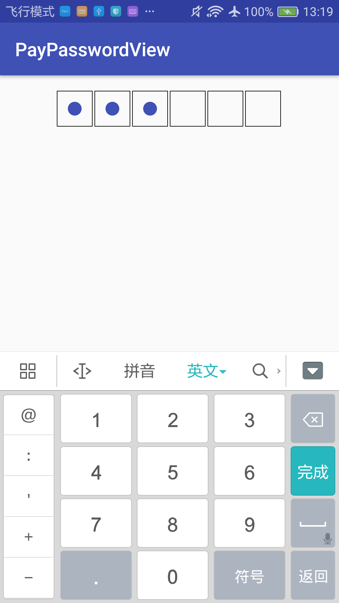

# PayPasswordView

常用的数字支付密码控件



使用方法:
```
  compile 'com.twisty:ppv:1.0.0'
```

xml:

```
   <com.twisty.ppv.PayPasswordView
        android:id="@+id/ppv"
        android:layout_width="wrap_content"
        android:layout_height="wrap_content"
        android:layout_centerHorizontal="true"
        app:ppv_autoClear="true"//输入完毕是否自动清除输入内容
        app:ppv_borderColor="#000000"//边框颜色
        app:ppv_dotColor="@color/colorPrimary"//圆点颜色
        app:ppv_length="6"//密码长度
        />
```
代码中接收输入内容

```
 ppv.setOnInputDoneListener(new PayPasswordView.OnInputDoneListener() {
            @Override
            public void onInputDone(String res) {
                Toast.makeText(MainActivity.this, res, Toast.LENGTH_SHORT).show();
            }
        });
```
